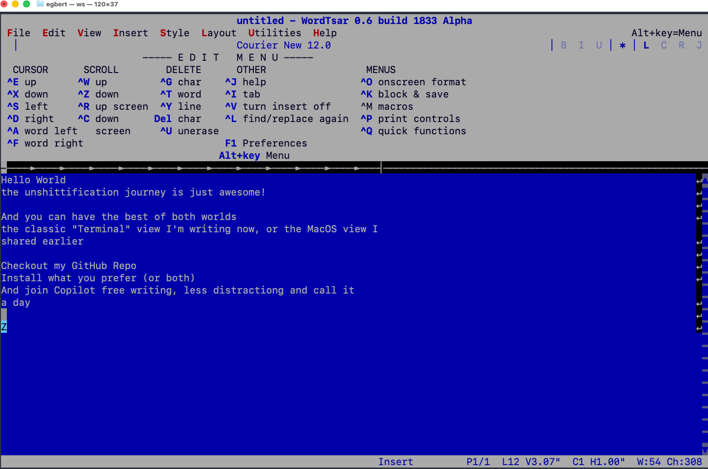

# WordTsar

## This is a macOS-focused fork of [WordTsar](https://sourceforge.net/p/wordtsar/mercurial/ci/default/tree/), created by Gerald Brandt.

Wordstar for the 21st Century. WordTsar is a Wordstar 7.0D document mode clone. It loads Wordstar 4, Wordstar 7, RTF (partial), and DOCX (partial) files, and saves in Wordstar 7, RTF, and Word (.docx) format.

All credit for WordTsar's design and implementation goes to Gerald Brandt — this fork simply trims the project down to a macOS-only build. The original, cross-platform project (Windows, Linux, and macOS) lives at the link above and at [wordtsar.ca](http://wordtsar.ca); go there for the full story, the forums, and the Windows/Linux builds.

WordTsar is currently Alpha. What does Alpha mean? Alpha means the program works, but is feature incomplete.

This is version **0.6.0 Alpha**, macOS only.

__BUILDING__

WordTsar requires Qt6, CMake 3.16+, and a C++20 compatible compiler. See [BUILDING.md](BUILDING.md) for full macOS build instructions.

There are two ways to run WordTsar, built from the same source:

- **`WordTsar`** — the Qt6 GUI app (`WordTsar.app`). Built by default.
- **`ws`** — a terminal UI, for writing entirely in a terminal window with no window chrome at all. Off by default; opt in with `cmake .. -DBUILD_TUI=ON`. See [BUILDING.md](BUILDING.md#build-targets) for details.

Both read and write the same document formats and share the same editing engine — pick whichever fits how you want to write.

You get the best of both worlds: the classic terminal view, or the macOS GUI — install whichever you prefer, or both. Distraction-free writing, no bloat, one keystroke away.

__NOTES__

- If the on-screen command help panel (the block of Ctrl-key commands under the ruler) disappears in the terminal UI, press **Ctrl-J** then **J** to toggle it back on.
- A backup of your file is made every 1 minute. Backups are in Wordstar format.
- The initial page/paper size is 8.5" x 11"
- The 0.5.x releases use UTF8 for all in-memory storage of the document and supports Unicode version 16.

__Source code [GNU Affero General Public License v3.0](LICENSE.md).__
