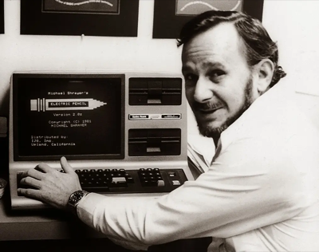
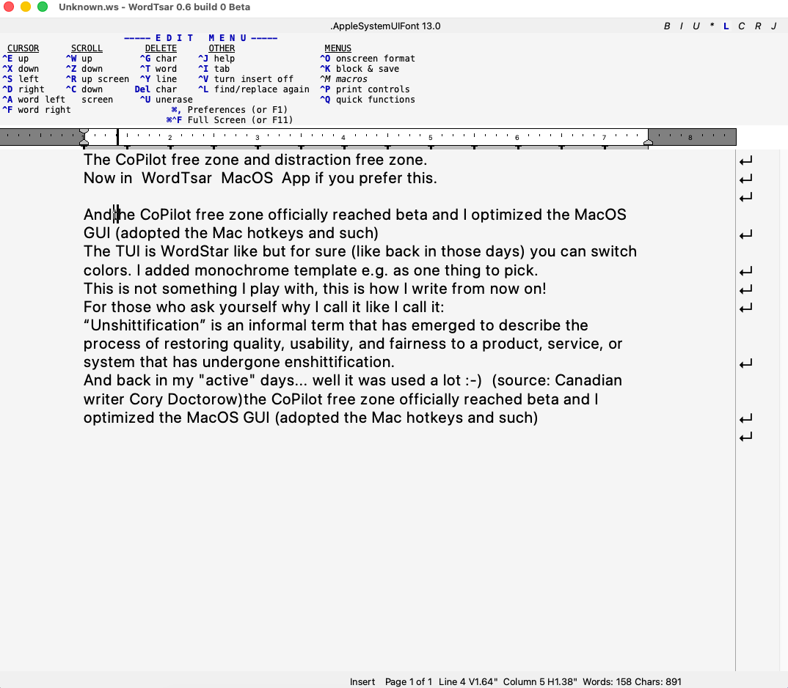

# WordTsar

  

## This is a macOS-focused fork of [WordTsar](https://sourceforge.net/p/wordtsar/mercurial/ci/default/tree/), created by Gerald Brandt.

Wordstar for the 21st Century. WordTsar is a Wordstar 7.0D document mode clone. It loads Wordstar 4, Wordstar 7, RTF (partial), and DOCX (partial) files, and saves in Wordstar 7, RTF, and Word (.docx) format.

All credit for WordTsar's design and implementation goes to Gerald Brandt — this fork simply trims the project down to a macOS-only build. The original, cross-platform project (Windows, Linux, and macOS) lives at the link above and at [wordtsar.ca](http://wordtsar.ca); go there for the full story, the forums, and the Windows/Linux builds. This fork is not endorsed by or affiliated with the upstream WordTsar project — the AGPL grants no rights in the name "WordTsar." macOS fork begun 2025, actively maintained through 2026.

   
  Michael Shrayer's <em>Electric Pencil</em> (1976, TRS-80) — generally credited as the first word processor for a microcomputer, and the ancestor this whole lineage owes a nod to.

WordTsar is currently Beta. What does Beta mean? The core is solid and well-tested, but a handful of things remain unverified or incomplete — see `WHATS_NEW.md` for specifics.

This is version **0.10.7 Beta**, macOS only.

## Building

WordTsar requires Qt6, CMake 3.16+, and a C++20 compatible compiler. See [BUILDING.md](BUILDING.md) for full macOS build instructions.

There are two ways to run WordTsar, built from the same source:

- **`WordTsar`** — the Qt6 GUI app (`WordTsar.app`). Built by default.
- **`ws`** — a terminal UI, for writing entirely in a terminal window with no window chrome at all. Off by default; opt in with `cmake .. -DBUILD_TUI=ON`. See [BUILDING.md](BUILDING.md#build-targets) for details.

Both read and write the same document formats and share the same editing engine — pick whichever fits how you want to write.

TUI (terminal-based version):

GUI (macOS app version):

You get the best of both worlds: the classic terminal view, or the macOS GUI — install whichever you prefer, or both. Distraction-free writing, no bloat, one keystroke away.

## Notes

- If the on-screen command help panel (the block of Ctrl-key commands under the ruler) disappears, press **F1** twice and choose help level 3 or 4 to bring it back — matches real WordStar 7's own help-level toggle (`F1 F1`).
- **F1** is also real, per-command help: press it, then any command key, for a one-line description of what that command does.
- In the GUI, some of these use Mac keyboard shortcuts instead of the classic F1/F3/F11, which macOS reserves for brightness, Mission Control, and Show Desktop and won't reliably reach any app:
  - **⌘,** (Cmd+Comma) → Preferences
  - **⌘/** (Cmd+Slash) → Help (same as F1)
  - **⌘⌃F** (Cmd+Ctrl+F) → Toggle Fullscreen
  - **⌘G** (Cmd+G) → Find Again

  F1 still works as a bonus for Help if you free it yourself in *System Settings > Keyboard > Keyboard Shortcuts* (Preferences moved fully to ⌘, since F1 now has a real WordStar job). See `KEY_MAPPING.md` for details.
- A backup of your file is made every 1 minute. Backups are in Wordstar format.
- The initial page/paper size is 8.5" x 11"
- The 0.5.x releases use UTF8 for all in-memory storage of the document and supports Unicode version 16.
- File → Print opens the native macOS print dialog and prints directly, separate from File → Print Preview. The TUI's `^KP` prints via CUPS.
- Spell check dictionary language (System Preferences > Editor) is applied on macOS via `NSSpellChecker`, so any installed system dictionary (not just English) works.
- DOCX import is partial: paragraph text, character formatting, and basic page setup come through, but tables, list numbering, images, and header/footer content do not import yet. DOCX export doesn't cover tables or headers/footers either. See `WHATS_NEW.md` for the full state.

## Credit where it belongs

WordTsar is Gerald Brandt's. He designed it, wrote it, and has maintained it for years — the editing engine, the layout and rendering engines, the WordStar 7 fidelity, the file format handling. Nearly all the code in this repository is his.

He is also, by night, a novelist: the San Angeles cyberpunk trilogy — *The Courier*, *The Operative*, *The Rebel* — published by DAW, and the Quantum Empirica books. *The Courier* was a finalist for the Aurora Award and was named by the CBC as one of ten Canadian science fiction books you need to read. And he writes them in WordTsar. In [his own words](https://geraldbrandt.com/about/): IT administration and C++ by day, author by night, working entirely in the WordStar 7 clone he wrote and maintains himself.

That is the rarest thing about this program. It isn't a nostalgia project or a museum piece — it's a working writer's daily tool, built by someone who has to live with every decision in it. It shows in the details.

For me it has become the quiet place where writing actually happens: no ribbon, no sidebar, no notifications, nothing asking for attention. This fork exists only because I wanted that on one platform, with less to maintain. The original cross-platform WordTsar — Windows, Linux, and macOS — lives at [wordtsar.ca](http://wordtsar.ca) and remains the one to use. Thank you, Gerald.

## Feedback

This fork is actively developed. If you use it and run into a bug, a missing feature, or just want to share how it's working for you, please [open an issue](https://github.com/Egbert-Azure/WordTsar/issues) on this repo.

**Source code [GNU Affero General Public License v3.0](LICENSE.md).**